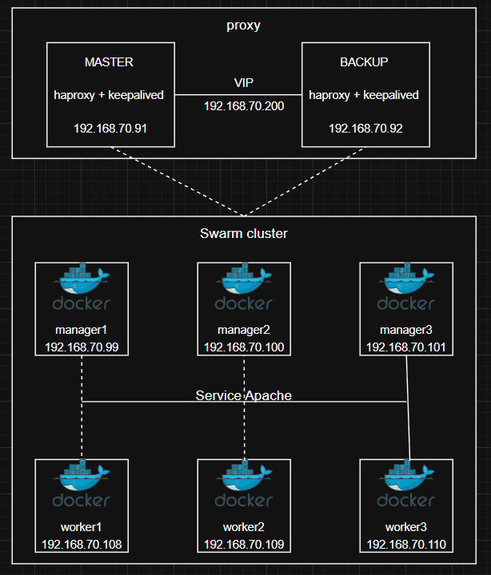
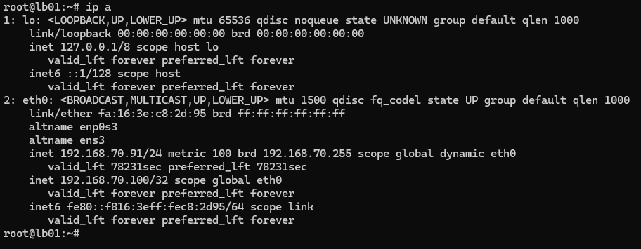

# Triển khai apache HA 

## I. Mô hình 



## II. Cài đặt 

### 2.0 Triển khai service apache trên swarm 

**Bước 1:** Tạo overlay network 

```bash
docker network create \
  --driver overlay \
  web-network
```

**Bước 2:** Viết file `apache-stack.yml` với nội dung như sau: 

```yml
version: "3.9"

services:
  apache:
    image: httpd:2.4

    deploy:
      replicas: 3

    ports:
      - "8080:80"

    networks:
      - web-network

networks:
  web-network:
    external: true
```

**Bước 3:** deploy service apache trên cụm Swarm 

```bash
docker stack deploy -c apache-stack.yml web
```

```bash
root@mgr1:~/LAMP-stack-HA/apache# docker service ls
ID             NAME         MODE         REPLICAS   IMAGE       PORTS
qr86jw1ii8oq   web_apache   replicated   3/3        httpd:2.4   *:8080->80/tcp
```

### 2.1 Cấu hình LB 

**Bước 1:** Cài HAProxy trên lb01 và lb02 

```bash
apt update 
apt install haproxy -y
```

**Bước 2:** Cấu hình HAProxy 

```bash
vim /etc/haproxy/haproxy.cfg
```

```bash 
global
    daemon

defaults
    mode http

    timeout connect 5s
    timeout client 30s
    timeout server 30s

frontend apache_front
    bind *:80

    default_backend apache_backend

backend apache_backend
    balance roundrobin

    option httpchk GET /

    server mgr1 192.168.70.99:8080 check
    server wrk1 192.168.70.108:8080 check
```

Restart: 

```bash
systemctl restart haproxy 
systemctl status haproxy
```

```bash
* haproxy.service - HAProxy Load Balancer
     Loaded: loaded (/lib/systemd/system/haproxy.service; enabled; vendor preset: enabled)
     Active: active (running) since Mon 2026-06-01 15:31:05 +07; 64ms ago
       Docs: man:haproxy(1)
             file:/usr/share/doc/haproxy/configuration.txt.gz
    Process: 2311 ExecStartPre=/usr/sbin/haproxy -Ws -f $CONFIG -c -q $EXTRAOPTS (code=exited, status>
   Main PID: 2313 (haproxy)
      Tasks: 7 (limit: 6964)
     Memory: 60.1M
        CPU: 219ms
     CGroup: /system.slice/haproxy.service
             |-2313 /usr/sbin/haproxy -Ws -f /etc/haproxy/haproxy.cfg -p /run/haproxy.pid -S /run/hap>
             `-2315 /usr/sbin/haproxy -Ws -f /etc/haproxy/haproxy.cfg -p /run/haproxy.pid -S /run/hap>

Jun 01 15:31:05 lb02 systemd[1]: haproxy.service: Deactivated successfully.
Jun 01 15:31:05 lb02 haproxy[2139]: [WARNING]  (2139) : Exiting Master process...
Jun 01 15:31:05 lb02 haproxy[2139]: [NOTICE]   (2139) : haproxy version is 2.4.30-0ubuntu0.22.04.1
Jun 01 15:31:05 lb02 haproxy[2139]: [NOTICE]   (2139) : path to executable is /usr/sbin/haproxy
Jun 01 15:31:05 lb02 haproxy[2139]: [ALERT]    (2139) : Current worker #1 (2152) exited with code 143>
Jun 01 15:31:05 lb02 haproxy[2139]: [WARNING]  (2139) : All workers exited. Exiting... (0)
Jun 01 15:31:05 lb02 systemd[1]: Stopped HAProxy Load Balancer.
Jun 01 15:31:05 lb02 systemd[1]: Starting HAProxy Load Balancer...
Jun 01 15:31:05 lb02 haproxy[2313]: [NOTICE]   (2313) : New worker #1 (2315) forked
Jun 01 15:31:05 lb02 systemd[1]: Started HAProxy Load Balancer.
lines 1-24/24 (END)
```

Kiểm tra thử HAProxy đã hoạt động thành công chưa: 


**Bước 3:** Cài keepalived 

```bash
apt install keepalived -y 
```

**Bước 4:** Cấu hình lb01 (MASTER) 

Phân hoạch IP: 

```bash
lb01 = 192.168.70.91
lb02 = 192.168.70.92

VIP = 192.168.70.200
```

Để cho phép HAProxy ràng buộc vào các địa chỉ IP được chia sẻ, chúng ta thêm dòng sau vào `/etc/sysctl.conf`:

```bash
net.ipv4.ip_nonlocal_bind=1
```

```bash
vim /etc/keepalived/keepalived.conf
```

```bash
vrrp_script chk_haproxy {
    script "killall -0 haproxy"
    interval 2
    weight 2
}

vrrp_instance VI_1 {
    state MASTER

    interface eth0
    virtual_router_id 51

    priority 101
    advert_int 1

    authentication {
        auth_type PASS
        auth_pass 123456
    }

    virtual_ipaddress {
        192.168.70.200
    }

    track_script {
        chk_haproxy
    }
}
```

khởi động keepalived: 

```bash
systemctl enable keepalived 
systemctl restart keepalived 
```

**Bước 5:** Cấu hình lb02 (BACKUP) 

Để cho phép HAProxy ràng buộc vào các địa chỉ IP được chia sẻ, chúng ta thêm dòng sau vào `/etc/sysctl.conf`:

```bash
net.ipv4.ip_nonlocal_bind=1
```

```bash
vrrp_script chk_haproxy {
    script "killall -0 haproxy"
    interval 2
    weight 2
}

vrrp_instance VI_1 {
    state BACKUP

    interface eth0
    virtual_router_id 51

    priority 100
    advert_int 1

    authentication {
        auth_type PASS
        auth_pass 123456
    }

    virtual_ipaddress {
        192.168.70.200
    }

    track_script {
        chk_haproxy
    }
}
```

Kiểm tra xem trên node MASTER đã có VIP chưa:



