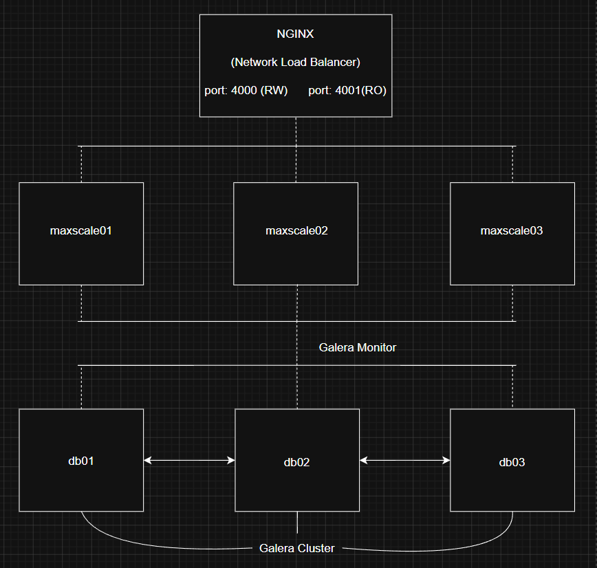

# MariaDB High Availability Stack 
A production-ready MariaDB Galera Cluster with MaxScale load balancing and Nginx TCP proxy, fully containerized with Docker Compose 

## Architecture Overview 



## Traffic Flow 

|Port|Role|Path|
|---|---|---|
|`:4000`|Read/Write|Nginx -> MaxScale RW-service -> db01/db02/db03|
|`:4001`|Read Only|Nginx -> MaxScale RO-service -> db02/db03|


## Components
### 1. MariaDB Galera Cluster (db01, db02, db03) 
- Multi-master synchronous replication via Galera 
- All nodes can accept writes; data is replicated to all peers 
- SST method: `rsync`
- Storage engine: `InnoDB` with `ROW` binlog format 

|Node|Role on Bootstrap|`wsrep_cluster_address`|
|---|---|---|
|db01|Bootstrap node|`gcomm://`|
|db02|Joiner|`gcomm://db01,db02,db03`|
|db03|Joiner|`gcomm://db01,db02,db03`|

### 2. MaxScale (maxscale01, maxscale02, maxscale03) 
- 3 redundant MaxScale instances for proxy-level HA 
- `galeramon` monitors cluster health every 2 seconds 
- Two routing services:

|Service|Router|Servers|Purpose|
|---|---|---|---|
|`RW-service`|`readwritesplit`|db01,db02,db03|Splits reads/writes automatically|
|`RO-service`|`readconnroute`|db02,db03|Read-only traffic, keeps db01 free|

### 3. Nginx (TCP Proxy) 
- Acts as the single entry point for applications
- Uses `least_conn` algo to distribute across 3 MaxScale Instances 
- Provides MaxScale-level HA: if one MaxScale goes down, traffic is rerouted automatically 

## Project Structure 

```bash
.
├── docker-compose.yml
├── makefile
├── db01/
│   └── db01.cnf          # Galera config for bootstrap node
├── db02/
│   └── db02.cnf          # Galera config for db02
├── db03/
│   └── db03.cnf          # Galera config for db03
├── maxscale/
│   └── maxscale.cnf      # MaxScale routing & monitoring config
└── nginx/
    └── nginx.cnf         # Nginx TCP stream proxy config
```

## Getting Started 

### Prerequisites 
- Docker >= 20.x
- Docker Compose >= 1.29 
- `make`

### First-time Bootstrap 

**Important:** Do NOT use `make up` on the first run. The Galera cluster requires db01 to initialize first before other nodes join. 

```bash
make bootstrap
```

This command wwill: 

1. Start `db01` as the Galera bootstrap node 

2. Wait until `db01` is healthy and accepting connections

3. Start `db02` and `db03` to join the cluster 

4. Create the `maxscale` user with required privileges 

5. Start all 3 MaxScale instances and Nginx 

### Subsequent Starts 

After the cluster has been bootstrapped once, you can use: 

```bash
make up 
```

### Makefile Commands

| Command | Description |
|---------|-------------|
| `make bootstrap` | **First-time only** — bootstraps the full stack in correct order |
| `make up` | Start all services |
| `make down` | Stop all services (data volumes preserved) |
| `make restart` | Restart all services |
| `make ps` | Show status of all containers |
| `make logs` | Tail logs from all containers |
| `make status` | Check Galera cluster size via db01 |
| `make clean` | Stop all services **and delete all volumes** |
| `make shell-db01` | Open a bash shell inside db01 |
| `make shell-db02` | Open a bash shell inside db02 |
| `make shell-db03` | Open a bash shell inside db03 |
| `make shell-maxscale01` | Open a bash shell inside maxscale01 |
| `make shell-maxscale02` | Open a bash shell inside maxscale02 |
| `make shell-maxscale03` | Open a bash shell inside maxscale03 |
| `make shell-nginx` | Open a bash shell inside nginx |

## Verification

### Check Galera Cluster Status

```bash
make status
# Expected output:
# +--------------------+-------+
# | Variable_name      | Value |
# +--------------------+-------+
# | wsrep_cluster_size | 3     |
# +--------------------+-------+
```

### Check MaxScale via Admin API

```bash
# MaxScale instance 1
curl http://localhost:8981/v1/servers

# MaxScale instance 2
curl http://localhost:8982/v1/servers

# MaxScale instance 3
curl http://localhost:8983/v1/servers
```

### Test Read/Write Connection

```bash
# Read/Write (port 4000)
mysql -h 127.0.0.1 -P 4000 -umaxscale -p123456 -e "SELECT @@hostname;"

# Read Only (port 4001)
mysql -h 127.0.0.1 -P 4001 -umaxscale -p123456 -e "SELECT @@hostname;"
```
## Configuration Reference

### MaxScale User

The `maxscale` monitoring user is created automatically by `make bootstrap`:

```sql
CREATE USER IF NOT EXISTS 'maxscale'@'%' IDENTIFIED BY '123456';
GRANT ALL PRIVILEGES ON *.* TO 'maxscale'@'%';
FLUSH PRIVILEGES;
```

**Security note:** Change the default passwords (`root`, `123456`) before deploying to any non-local environment.

### Key Galera Parameters

| Parameter | Value | Description |
|-----------|-------|-------------|
| `wsrep_on` | `ON` | Enable Galera replication |
| `wsrep_cluster_name` | `galera_cluster` | Cluster identifier |
| `wsrep_sst_method` | `rsync` | State Snapshot Transfer method |
| `binlog_format` | `ROW` | Required for Galera |
| `innodb_autoinc_lock_mode` | `2` | Required for Galera multi-master |

## Teardown 

```bash
# Stop and remove containers (keep data volumes)
make down

# Stop, remove containers AND all data volumes (full reset)
make clean
```

## Notes
- This setup is designed for **local development and testing**. For production use, consider adding TLS, stronger passwords, persistent log shipping, and external monitoring.
- The `db01.cnf` uses `gcomm://` (empty address) intentionally — this is the Galera **bootstrap** address used only on first cluster initialization.
- Nginx config references MaxScale ports `4001–4006` on each instance; ensure MaxScale listener ports are consistent across all three MaxScale configs if you add more instances.
